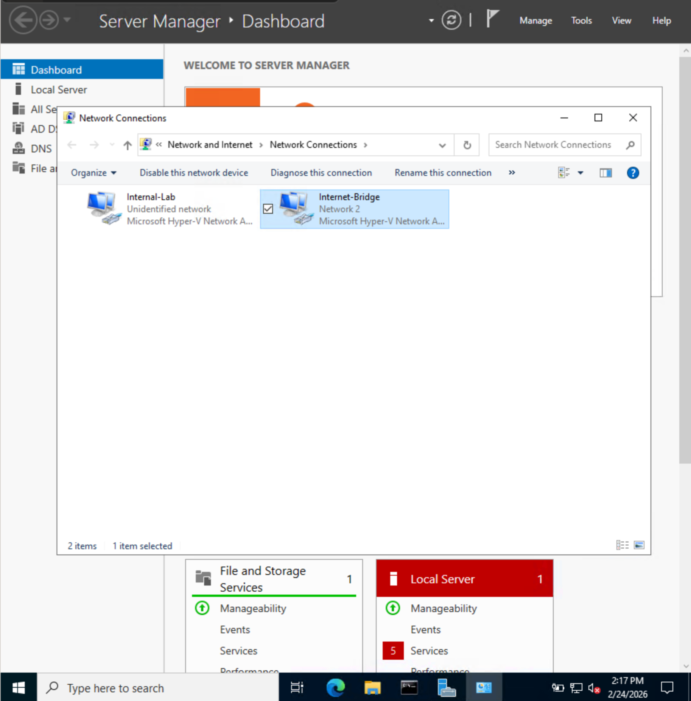
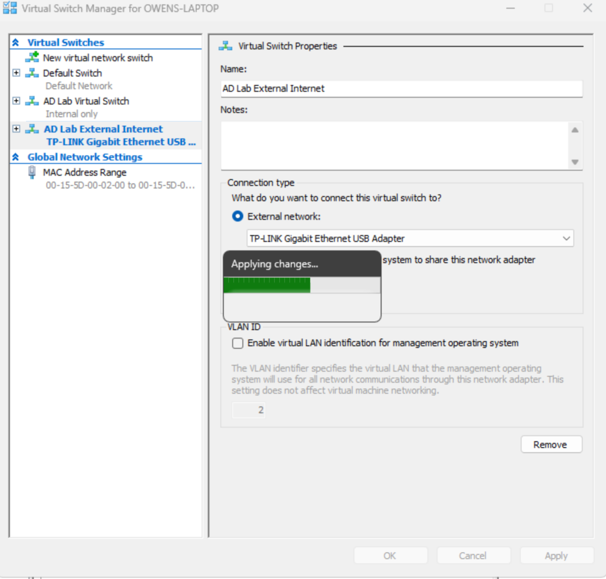
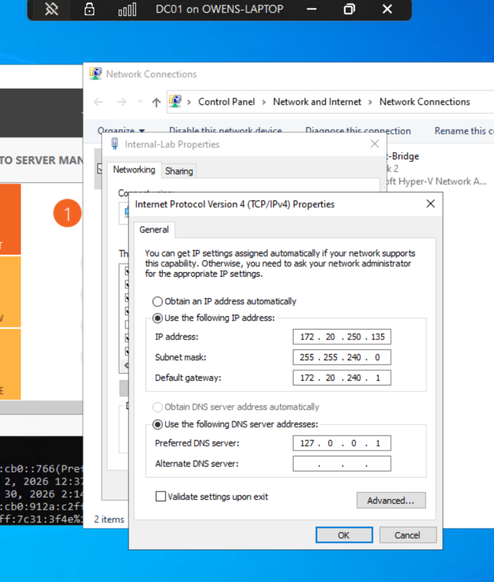
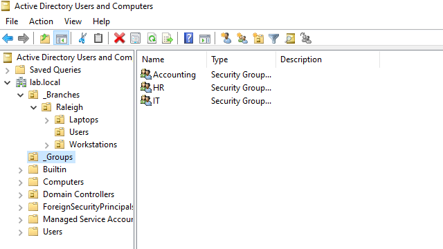
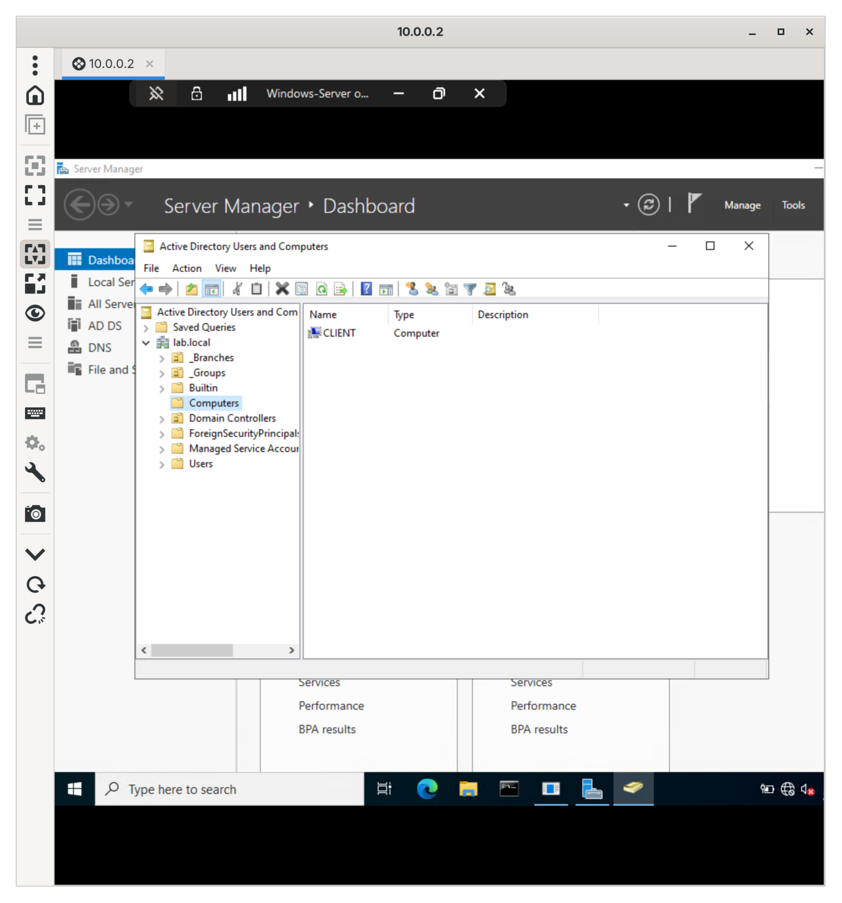
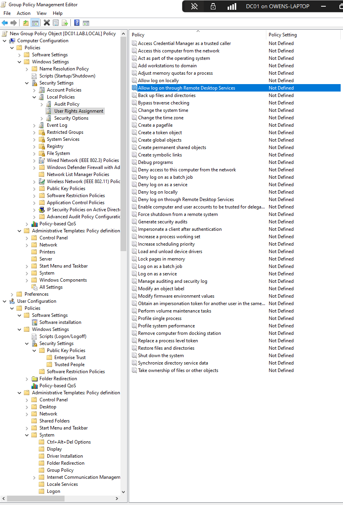

# ADDS & Entra ID Provisioning Lab
Enterprise Infrastructure Simulation of Windows Server Active Directory Domain Services and Entra ID provisioning for Zendesk, steps with images.

## Project Overview
This lab simulates a professional corporate environment by bridging **On-Premises Windows Infrastructure** with **Cloud-based SaaS** tools. I built a private network from scratch, configured core networking services, and integrated a ticketing system to handle real-world Service Desk scenarios.

## Creating the Virtual Machines
* I created two virtual machines with Microsoft Hyper-V, allocating 4GB of RAM to each and 80GB of virtual disk space. One is the domain controller (DC01) with Windows Server 2022 and the other is a client workstation (CLIENT01) with Windows 10.

* I created two virtual network interfaces, one called Internal-Lab, which connects the Client to the Domain Controller, and one called Internet-Bridge, which bridges internet connectivity from the Domain Controller to the Client. By configuring this dual-homed setup, I established a secure gateway where the Domain Controller functions as a router, providing the internal lab assets (Client) with WAN access through Network Address Translation (NAT) without exposing them directly to the public internet. We configure this fully when we set up RRAS.

## Configuration of DC01
* When Windows Server OS finished installing, I entered "Administrator" for the username and a strong password I could remember.
* Upon logging in, I went to Network Connections (run ncpa.cpl) and configured a static IP

## Configuring Active Directory
* In the Server Manager, I click Add Roles and Features under Manage in the top right corner.
* I select "Role-based or feature-based installation".
* I select DC01 as the Server.
* I select Active Directory Domain Services, DHCP Server, DNS Server, and Remote Access. Any default features I also add.
* I confirm installation and click install.

## Promoting to Domain Controller
* Once the features are done installing, I click the yellow flag in the top right corner and click promote to domain controller

* In the AD DS Wizard, I click **Add a new forest**. For now, my root domain name is "lab.local"

* In the next steps, I leave them as default and I input a Directory Services Restore Mode password, which is something that needs to be saved in case AD is in need of recovery.
* I leave the rest of the steps as the default and ignore warnings in the Prerequisites Check, as is this a lab environment. Then I click install.

* After rebooting the machine, i'm able to log in to the Administrator account in the domain under **LAB\Administrator**
* In an elevated command prompt, I am able to see the domain's IP address using `nslookup lab.local`

## Creating Organizational Units
* In the Server Manager, I click **Tools** in the top right corner and click **Active Directory Users and Computers**.
* I right click lab.local, then **New**, then **Organizational Unit**.
* I name the OU **_Branches** with an underscore so it appears first in a list, and I make sure **Protect container from accidental delection** is checked.
* Under _Branches, I create another OU called **Raleigh**, and under Raleigh, I create three more called **Users**, **Workstations**, and **Laptops**.

## Creating Users
* In Active Directory Users and Computers, I right click the **Users** OU I created in the last step and then **New**, then **Users**.
* I create three users (Jim Valvano, DJ Burns, and James Goodnight). A password is set for each one and I leave **User must change password at next logon** unchecked.

## Creating Security Groups
* In Active Directory Users and Computers, I right click lab.local, then **New**, then **Organizational** **Unit**. This OU is called **_Groups**.
* When right clicking _Groups, I select **New**, then **Group**.
* Here I create 3 Groups called Accounting, HR, and IT. The group scope is **Global** and the group type is **Security**

* Each user I created is assigned a security group. To do this, I open the group, select the members tab, then add the user.

## Client Computer Domain Configuration
* Using the CLIENT01 Workstation created in previous steps, we will first log in with a local administrator account.
* Upon login, we will go to network connections (Windows + R, ncpa.cpl), and change the IPv4 properties of the network adapter so that the preferred DNS server is the domain controller's private IP Address. This ensures that our Active Directory Domain Names can be read by our client computer.
* Next is to join the domain. We will need to open **Settings**, **System**, **About**, then **Rename this PC (advanced)**.
* Here we can rename the computer to **client**, and make it a member of **lab.local**. It will prompt to restart the PC.

* Upon restart, we can log in to the client computer as our domain administrator account. We can see in Active Directory our new client in **lab.local** under the container **Computers**.

## Group Policy RDP Access & Domain User Login
* I am doing this lab with Remote Desktop Protocol into my home server. Ths, I must configure a specific permission to allow a non-administrator to log in via Remote Desktop Protocol.
* In the Server Manager, I click **Tools** in the top right corner and click **Group Policy Management**.
* I right click the **Raleigh** group, then **Create a GPO in this domain, and Link it here...**
* In the image below we see where to locate the Remote Desktop Services permission.

* Here we see 
* In the client login screen, we select Other User

